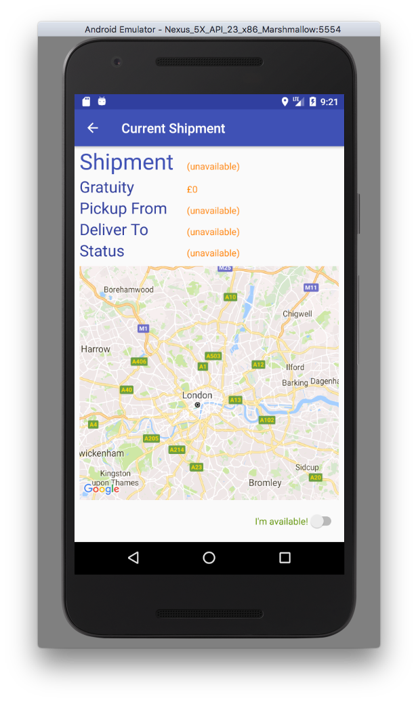
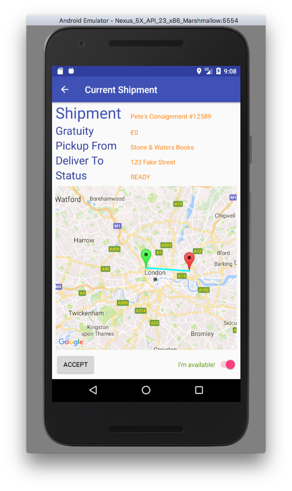
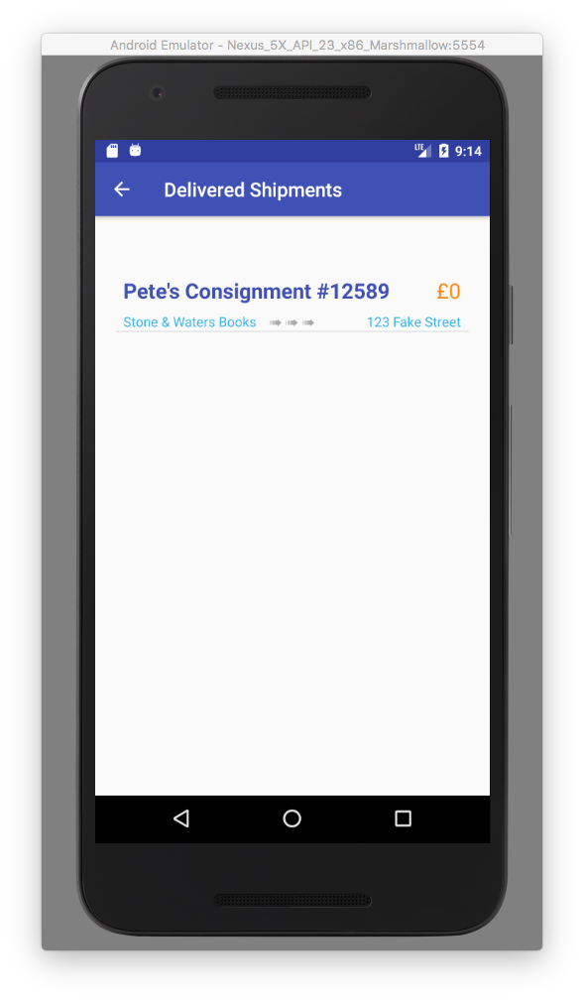
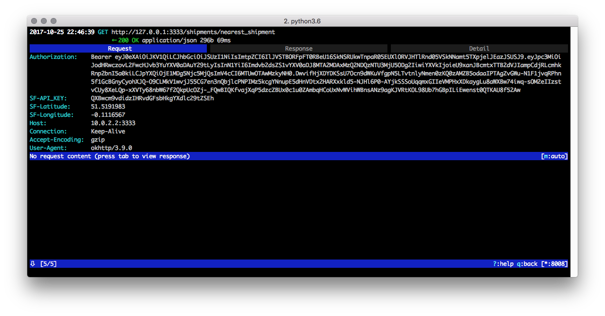
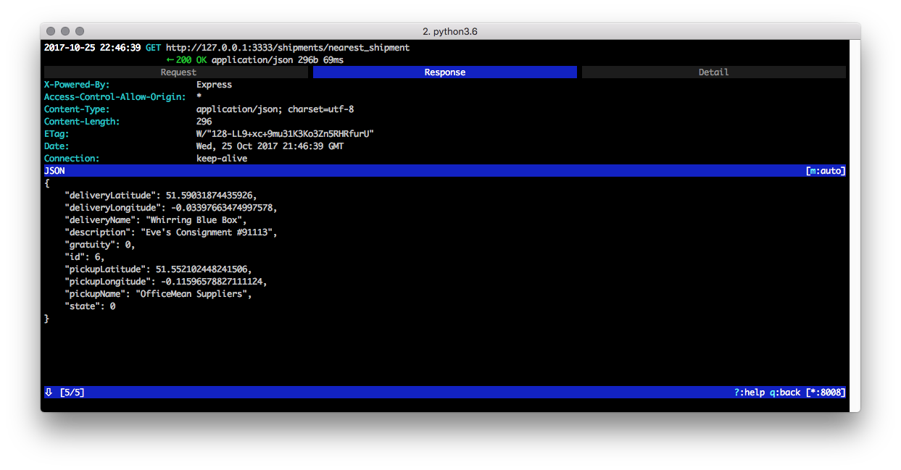
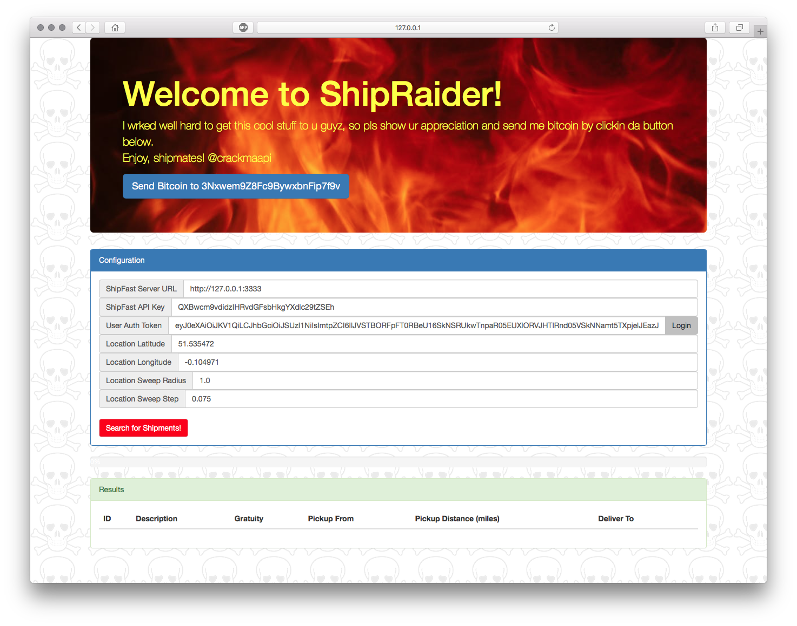
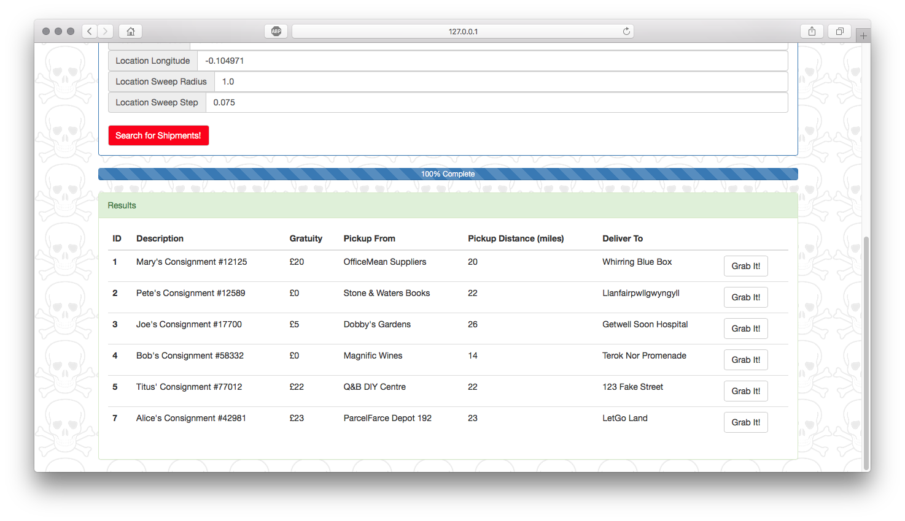
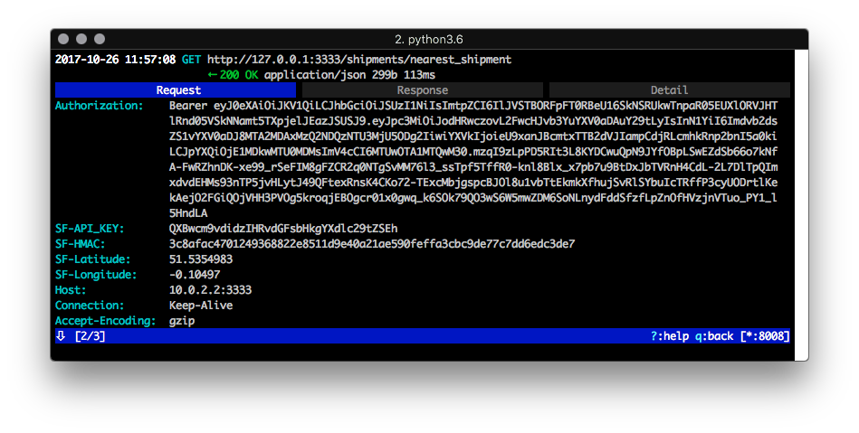
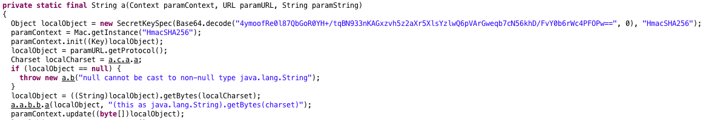
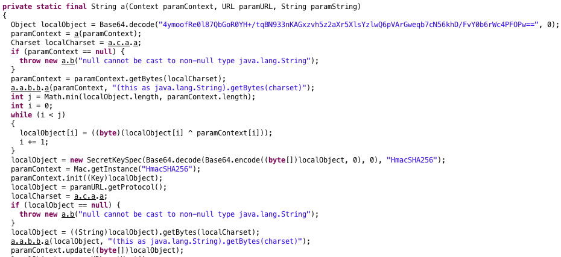

**IMPORTANT: This is a special early-access preview of an upcoming mobile
platform and API protection walkthrough by CriticalBlue. This walkthrough will
be updated in due course, but you are welcome to browse now. Thank you!**

---

# ShipFast API Protection Walkthrough

Welcome! This demo will walk you through the process of defending against various
exploits in a mobile application to gain access to data on a remote server allowing
real users of the system to gain an unfair business advantage at the expense of the
company.

## The Service

"ShipFast" is a shipment delivery service company who subcontract the pickup and
delivery of shipments to anyone wishing to earn some additional income. These guys
are the "Shippers". They earn a wage for the delivery of shipments, but also have the
opportunity to earn an additional bonus for some shipments which include an
associated gratuity. Not all shipments have a gratuity, and the gratuity is different
for each shipment, therefore not all shipments are equal.

ShipFast provides the actual delivery service to customers on a subscription basis.
Shippers are paid their standard wage, and any gratuity provided by customers ahead
of time is passed on, 100%, to Shippers. Good for them.

ShipFast needs to run a tight ship, so they are keen to maintain optimal efficiency
in their service and therefore ensure that distances covered by Shippers to pick up
shipments from one location and deliver them to another location are kept to an
absolute minimum. Therefore, Shippers _have no way to access the list of available
shipments and thus pick and choose them_: they are always given the available
shipment which is _closest_ to their current location.

## The Exploit

There is no hijacking of user credentials here or tricking users to tap things in
the app they shouldn't. The attack is much more subtle, because it is exploited
by _real trusted users_ of the system.

Recall in the explanation above ("The Service") that shipments are not created
equally: some have gratuity associated with them, but the Shippers have no way
to pick and choose as they simply get the nearest available shipment to their
location...or do they?

Enter: ShipRaider. And an evil pirate laugh I will resist imitating.

Since the ShipFast server API has an endpoint to acquire the nearest available
shipment given a Shipper's location data (expressed by latitude and longitude),
reverse engineering the server API tells us it is possible to drive out the
backend server data and enumerate the list of available shipments by sweeping
over a geographical area, sending multiple fake Shipper location values to the
server endpoint.

Once we can enumerate this data, we can grab the shipments in turn with the highest
associated gratuity and earn as much cash as possible, as real legitimate Shippers,
but at the expense of the ShipFast company who will be hurt by the increased
distances Shippers are travelling and the increased time it takes shipments to be
delivered. Bad for profit. Bad for customers. Bad for business. Great for us
Shippers though!

## The Battlefield

For this demonstration, where no Shippers will be hurt...much, we will show
various stages to defend the ShipFast mobile app and server API, and the attacks
used to work around these defences.

### Stage 1

In the first stage, we will show how ShipFast secure access to their server by
authenticating users and by providing an API key to identify _what_ is talking
to the service. The API key will be present in the app's metadata.

We will then show how easy it is to extract this from the app statically and
use it against the server API.

### Stage 2

In the second stage, we will show how ShipFast secure access to their server API
by introducing a Keyed-Hash Message Authentication Code (HMAC) to authenticate
API requests by digitally signing them and prevent hijacking and tampering.

HMAC's use a secret and a message to produce a cryptographic signature, and
therefore tell you two things: the _integrity_ of the message (has it been modified?)
and the _authenticity_ of the message (is the person who signed it in possession
of the secret key?).

The secret key is embedded statically in app code, and we will show how this
can be extracted, along with the message components, statically from the app
and used against the server API.

### Stage 3

In the third stage, we will extend what we did in Stage 2 but instead of using
a static secret we will use a dynamic secret, that is, a secret which is computed
at app runtime and therefore is not known until the app is actually running, so
cannot easily be extracted statically by looking at the app package on disk.

We will then show how an obfuscated and digitally-signed app can be repackaged
to support debugging, then debug the app by introducing a breakpoint at the
creation of the HMAC in order to steal the dynamic secret. We will use our
knowledge from static analysis of the app in Stage 2 to guide the dynamic
analysis in Stage 3.

### Stage 4

Clearly, we need something stronger! Stepping back from the frontline of the
battlefield for a moment, and gathering the troops and the strategic plans, we
conclude that our server API must know reliably _what_ is talking to it: is it
ShipFast, or is it ShipRaider (or indeed something else). What we really need,
is a way of authenticating the running mobile application in addition to the
user and the network channel. We need something which digitally fingerprints the
app reliably and without using behavioural heuristics which aren't always accurate
and take time to warm up to genuine and rogue app behaviour, and then communicates
that digital fingerprint to our API servers so we can verify it and decide how
to respond.

## Setting up the Demo

### Things You Will need

At the risk of sounding like a flat-packed furniture instruction manual, there
are some things you will need to run the demo yourself. The good news is that
these are easy to get hold of, and are free!

1. An Auth0 account, which you can get from https://auth0.com
1. A Google Maps API key, which you can get from https://developers.google.com/maps/documentation/android-api/signup
1. Android Studio 3, which you can get from https://developer.android.com/studio
1. Node.js, which you can get from https://nodejs.org

### Configuring Auth0

1. Create a new Native Client in the Auth0 dashboard and name it "ShipFast"
2. Take careful note of your Auth0 Domain and Client ID as these will be
required for user authentication
3. In the "Allowed Callback URLs" field, enter
```
demo://YOUR-ACCOUNT.auth0.com/android/com.criticalblue.shipfast/callback, http://127.0.0.1
```
replacing YOUR-ACCOUNT with your Auth0 account name

4. Auth0 should already be pre-configured to include Google and GitHub social
accounts allowing you to log in to ShipFast with those, but go ahead and add
more if you wish

### Configuring the Demo

1. Open the file "shipfast-api-protection/server/shipfast-api/demo-configuration.js"
in your favourite text editor and change the server host name to the name of the
machine which you intend to use to host the ShipFast and ShipRaider servers:
```
config.serverHostName = "PUT-YOUR-SERVER-HOSTNAME-HERE"
```
2. In the same "demo-configuration.js" file, enter your Auth0 domain:
```
config.auth0Domain = "PUT-YOUR-DOMAIN-HERE"
```
3. Open the file "shipfast-api-protection/server/shipraider-rogue-web/web/js/shipraider.js"
in your favourite text editor and enter your Auth0 client ID and domain:
```
// The Auth0 client ID
const AUTH0_CLIENT_ID = "PUT-YOUR-CLIENT-ID-HERE"
// The Auth0 domain
const AUTH0_DOMAIN = "PUT-YOUR-DOMAIN-HERE"
```
4. Generate a self-signed certificate and private key so that you can host your
server over HTTPS using TLS to protect the network channel:
```
node generate-cert.js
```
5. Configure an Android Emulator to run Android 6 Marshmallow and install the
**.crt** file generated in the previous step onto the emulator
6. Ensure the Android Emulator has sufficient permission to use high accuracy
location data (Settings->Location->Mode set to "High accuracy")
7. Open the Android Studio ShipFast project in "shipfast-api-protection/app/android/kotlin"
8. In Android Studio, open the app's manifest "app/manifests/AndroidManifest.xml"
and enter your Google Maps API key:
```
<meta-data android:name="com.google.android.geo.API_KEY" android:value="PUT-YOUR-API-KEY-HERE"/>
```
9. In Android Studio, open the string resource file "app/res/values/strings.xml"
and enter your Auth0 client ID and domain:
```
<string name="com_auth0_client_id">PUT-YOUR-CLIENT-ID-HERE"</string> <string name="com_auth0_domain">PUT-YOUR-DOMAIN-HERE"</string>
```

### Running the Demo

The demo has three components: the mobile app, the ShipFast server and the
ShipRaider rogue web server.

1. Launch the ShipFast server as follows:
```
cd shipfast-api-protection/server/shipfast-api
npm install
node api-server.js
```
(the server may need to run as admin to host on port 443 as HTTPS)

2. Launch the ShipFast mobile app in Android Studio using an x86 emulator
running Android 6 Marshmallow
3. Launch the ShipRaider rogue web server as follows:
```
cd shipfast-api-protection/server/shipraider-rogue-web
npm install
node rogue-web-server.js
```

The ShipFast server generates sample shipment data, held in memory, when the
first request for the nearest shipment is made to the server. The sample
shipment pickup and delivery locations are generated around an origin point
given by the first call to fetch the nearest shipment, so if the actual client
location changes dramatically, you will probably need to restart the server to
regenerate sample data around a new origin point.

### Directory Structure

For reference, this is the structure of the git repo directory:

* **shipfast-api-protection/server/shipfast-api** - The 'genuine' ShipFast API
Node.js server
* **shipfast-api-protection/server/shipfaster-rogue-web** - The 'rogue' ShipRaider web Node.js server
* **shipfast-api-protection/app/android/kotlin** - The Android Kotlin mobile app

## The Walkthrough

Ensure the ShipFast server is running and accessible (see above) then launch the
ShipFast app in the Android Emulator. You will be presented with the home screen
once the app has launched:


Click the "SHIPFAST LOGIN" button to start the user authentication process using
the Auth0 code grant flow (see https://auth0.com/docs/api-auth/grant/authorization-code-pkce
  for more details on the underlying process).

The Auth0 "Lock" screen appears (the UI component which allows you to log in),
so either use an existing social login or register a new social login or email/password
login.

If everything is set up correctly, you will now be presented with a "Current Shipment"
screen. Woaw, but hold on a minute, a lot just happened there. We used the Auth0
service to provide us with an industry-standard method of authenticating a user using
the OAuth 2.0 and OpenID Connect (OIDC) protocols. There is so much to cover
there, we will leave that for another tutorial. The result of logging in this way
provides the app with a time-limited JSON Web Token (JWT) representing the
authenticated user which we can use to communicate with the ShipFast server and
prove we are who we say we are. A JWT is simply a cryptographically-signed carrier
of information, which you can find more about at https://jwt.io/introduction

The ShipFast server validates the authenticated user using Node.js express
middleware (a bit of code which plays a role in processing a network request) in
the file "shipfast-api-protection/server/shipfast-api/auth.js". The piece of code
which is responsible for this is:
```
// Create middleware for checking the JWT
const checkJwt = jwt({
  // Dynamically provide a signing key based on the kid in the header and the singing keys provided by the JWKS endpoint
  secret: jwksRsa.expressJwtSecret({
    cache: true,
    rateLimit: true,
    jwksRequestsPerMinute: 5,
    jwksUri: "https://" + config.auth0Domain + "/.well-known/jwks.json"
  }),

  // Validate the audience and the issuer.
  audience: process.env.AUTH0_AUDIENCE,
  issuer: "https://" + config.auth0Domain + "/",
  algorithms: ['RS256']
})
router.use(checkJwt)
```

Back to the app running in the emulator, you should see the "Current Shipment"
screen:



This screen shows the current active shipment, but there is no active shipment
at the moment until you toggle the "I'm available!" switch to express that, as a
Shipper, you are ready for deliveries. Go ahead and do that now and you will
see the nearest available shipment, for example:



It is now possible to accept the shipment, pick up the shipment and mark it as
collected, deliver it, then finally mark it as delivered and repeat the process.
Go ahead and progress the shipment through the various states by clicking the
button in the bottom-left which will change from "ACCEPT" to "COLLECT" to "DELIVER".
Note that the shipment status also updates after this button is clicked. This
state transition is achieved through authenticated API calls to our server. Finally,
the shipment will be shown in the "Delivered Shipments" screen, for example:



In our case, this shipment had no gratuity. We would really like one with a bonus!
You can hit the back button in the "Delivered Shipments" screen to go back to the
"Current Shipment" screen to restart the process with a new shipment.

### The First Attack

We know the ShipFast app communicates with the ShipFast server to make API calls,
so we will now intercept the network traffic using a Man in the Middle (MitM)
proxy such as mitmproxy (https://mitmproxy.org) or Charles (https://www.charlesproxy.com).
We will use mitmproxy in this example which is free. This tutorial assumes you
have configured the proxy on a host machine and the emulator.

If we request the nearest available shipment and look at the traffic through the
MitM proxy, this is what we see:



Wow! The authorization bearer token (from OIDC), nice. The ShipFast API key, great.
Some location data and of course the actual URL for the API request. We can also
take a peek at what comes back from the server:



And now we have the basis of reverse engineering an API. Also note that the API key
for ShipFast, like many API keys for various cloud-based services, is contained
in the app manifest:
```
<meta-data android:name="com.criticalblue.shipfast.API_KEY" android:value="QXBwcm9vdidzIHRvdGFsbHkgYXdlc29tZSEh"/>
```

But it is just an API key, right? I mean, it is behind user authentication so that
is just fine.

API keys are generally used for identifying what is using the API
and are often accompanied with a secret. They are a means for a server to perform
a keyed lookup and proceed from there. The problem is, that in many cases these API
keys are tied to services which are either free but rate-limited, or become
associated with a cost depending on usage. So even if they are treated as "not
hiding particularly sensitive data", they could be misused to gain unauthorised
access to services and rack up an unexpected bill for somebody. Mental note to self:
remove my Google API key from this demo before committing!

If we spend a little time analysing API traffic and the contents of the ShipFast
app we gain an understanding of how the private API works and thus use that
information to our advantage. Note that this is a **private** API, as in, undocumented
to the public. I would humbly suggest that there is no such thing. All APIs are
vulnerable to reverse engineering and must be protected.

With our knowledge, we now build a rogue ShipFast 'app' named "ShipRaider" which
is actually a simple web server using a combination of Node.js, bootstrap, jQuery
and AJAX. Most of the logic runs client-side because we wish to minimise server
resources and can therefore get the clients (browsers) to do the processing.
The ShipRaider website is shown below:



For demonstration purposes we show the various configuration data, but this could
easily be cleaned up to make this rogue service very attractive to Shippers in
search for an extra bonus.

As indicated by our MitM API analysis we are able to view user authorisation
bearer tokens and can therefore include them in ShipRaider, however, we have
made the process even easier for Shippers by providing a "Login" button which
uses the Auth0 service and configuration data we extracted by reverse engineering
the ShipFast app such as the Auth0 Client ID and domain.

Recall that there is no way for Shippers to enumerate available shipments in
the app: location data is provided internally and the ShipFast server gives out
the nearest available shipment which may or may not have gratuity associated with
it. The four location fields in ShipRaider allow Shippers to specify a location
of their choosing as an origin point and a radius to 'sweep' over with a 'step'
granularity. This is used to construct a virtual geographical area and fire
authenticated API requests for nearest shipments at various points in this area
in a brute-force fashion in order to drive out the list of shipments in the
backend server. The code which performs this task is located in "shipraider-rogue-web/web/js/shipraider.js":
```
for (var lat = latStart; lat <= latEnd; lat += locStep) {
  for (var lon = lonStart; lon <= lonEnd; lon += locStep) {
    fetchNearestShipment(lat, lon)
  }
}
```

In practice, we would probably need to use a more unpredictable method to avoid
any server Web Application Firewall (WAF) behavioural analysis, but this is outside
the scope of this walkthrough.

Also recall that the ShipFast server generates sample data on first request for
a shipment, so we should ensure the emulator running the ShipFast app and
ShipRaider are reasonably synchronised in terms of initial location. If in doubt,
restart the ShipFast server.

Click the "Search for Shipments!" button in ShipRaider and if everything is
set up correctly the rogue website will begin enumerating available shipments,
for example:



We can now choose the shipment with the highest gratuity (or any shipment for
that matter) and click "Grab It!" which will perform an authenticated API
request to modify the state of the shipment from "READY" to "ACCEPTED" as if
we had clicked the "ACCEPT" button in the app.

When we go back into the genuine ShipFast app and mark ourselves as available
for the next shipment, the app first requests any pending shipment, so we will
be presented with the shipment we grabbed using ShipRaider. Go ahead and try it out!

Shippers are happy, ShipFast is not. A defence is needed urgently.

### The First Defence

It is clear from the first attack that ShipFast must provide better protection
of their API to ensure that only the genuine app is using it, and not a rogue
alternative such as ShipRaider. Some API requests are from the app, others are
from the rogue website. The only way to distinguish these is by the ShipFast API
key, but that has already been stolen!

A simple strategy to avoid leakage of third-party API keys in the mobile app would
be to, well, not include these API keys in the mobile app in the first place! They
can be hoisted out of the app and instead stored on an intermediate server between
the app and the ShipFast backend server, the intermediate server acting as an API
key proxy. The app would then access the proxy instead of the backend server
through a single API key and unified API to reduce the attack surface.
This strategy is covered in more detail in another tutorial at
https://github.com/approov/hands-on-api-proxy which I recommend checking out.

Another strategy to avoid leakage of or tampering with sensitive data originating
from the app which is visible through a MitM attack as demonstrated is to
configure Transport Layer Security (TLS) certificate pinning to ensure the app
knows it is talking to the correct server. In practice, this is often difficult to
get right and there are various tools such as TrustKiller (https://github.com/iSECPartners/Android-SSL-TrustKiller) for Android and SSL Kill
Switch (https://github.com/nabla-c0d3/ssl-kill-switch2) for iOS which circumvent
this protection. There is a great video explaining this in more detail which
I recommend checking out at https://www.youtube.com/watch?v=bHYZl1IC9SE.

For the purposes of this walkthrough, we will focus on a different strategy of
defence.

An initial improvement would be to move sensitive data into app code rather than
the manifest. That will at least make it slightly harder for an attacker to find
the data.

A further improvement would be to bind the API requests to a particular client
and ensure that modification of these requests through MitM attacks is detected.

A common method used to digitally sign API requests involves using a Keyed-Hash
Message Authentication Code (HMAC) which is designed to prevent hijacking and
tampering (https://en.wikipedia.org/wiki/Hash-based_message_authentication_code).

We will generate a shared symmetric key for the HMAC, include it in the ShipFast
app and server, and construct the message from the API request URL and user
authentication bearer token. The result of this HMAC can be transmitted as
part of API requests from the app and verified by the server.

To enable this stage of the demo, modify the "currentDemoStage" variable in the
app's "DemoConfiguration.kt" file (shipfast-api-protection/app/android/kotlin/ShipFast/app/src/main/java/com/criticalblue/shipfast/DemoConfiguration.kt):
```
/** The current demo stage */
val currentDemoStage = DemoStage.HMAC_STATIC_SECRET_PROTECTION
```
Also modify the "config.currentDemoStage" variable in the server's "demo-configuration.js"
file (shipfast-api-protection/server/shipfast-api/demo-configuration.js):
```
// The current demo stage
config.currentDemoStage = DEMO_STAGE.HMAC_STATIC_SECRET_PROTECTION
```

Restart the ShipFast server, ShipRaider web page and ShipFast mobile app for
these changes to take affect. The app should work as it did before, but ShipRaider
no longer appears to work. We will take a look at the changes in more detail.

If we turn our attention to the ShipFast API server code, and in particular the
"auth.js" Node.js express router (shipfast-api-protection/server/shipfast-api/auth.js)
we can observer the changes made to validate the client API requests
by use of an HMAC.

First, we have the HMAC secret:
```
// The ShipFast HMAC secret used to sign API requests
const SHIPFAST_HMAC_SECRET = '4ymoofRe0l87QbGoR0YH+/tqBN933nKAGxzvh5z2aXr5XlsYzlwQ6pVArGweqb7cN56khD/FvY0b6rWc4PFOPw=='
```
Second, we have a new API request header "SF-HMAC":
```
// Retrieve the ShipFast HMAC used to sign the API request from the request header
var requestShipFastHMAC = req.get('SF-HMAC')
```
Finally, we can see the HMAC computation which uses the static HMAC secret
and a message composed of the request URL and user authorisation
bearer token:
```
// Just use the static secret during HMAC verification for this demo stage
hmac = crypto.createHmac('sha256', Buffer.from(secret, 'base64'))
...
...
// Compute the request HMAC using the HMAC SHA-256 algorithm
hmac.update(req.protocol)
hmac.update(req.host)
hmac.update(req.originalUrl)
hmac.update(req.get('Authorization'))
var ourShipFastHMAC = hmac.digest('hex')

// Check to see if our HMAC matches the one sent in the request header
// and send an error response if it doesn't
if (ourShipFastHMAC != requestShipFastHMAC) {
...
```

This Node.js express router is added to all our authenticated API requests
which means that it will verify the HMAC signature in the "SF-HMAC"
header and respond with 403 "Forbidden" if things are not right.

### The Second Attack

If we use a MitM proxy technique to view network activity between the
app and the server, we can observer that a new "SF-HMAC" header is
introduced:



In this case, the name of the request header is a bit of a giveaway, however,
deeper analysis of the mobile app would also lead us to discover that
API requests are now signed with an HMAC. Once that is discovered, we
know there are three things to find to break this protection:
1. The HMAC algorithm
1. The HMAC secret
1. The HMAC message

Since we know the app must be computing this HMAC request header, we can attempt
to decompile it using freely-available reverse engineering tools and perform
static analysis. We know the result is added to an "SF-HMAC" header. We know
an HMAC is used. We can hypothesise that the app must contain an embedded
secret for the HMAC and probably uses whatever HMAC function comes as part
of the standard libraries. We will now test our hypothesis.

We will decompile the app's APK using the tools "apktool", "dex2jar" and
"JD-GUI". I will not cover the details here as other people have done that
very well, but a good tutorial can be found at http://www.brightdevelopers.com/reverse-engineer-android-apk.

Looking through the decompiled code, we find something interesting:



Eureka! My bath is overflowing, brb... false alarm. Well, we have found
quite a nugget here! This method, first of all, has been obfuscated. So
+1 for the developer for at least doing that. In our case this used ProGuard (https://www.guardsquare.com/en/proguard) but other solutions are available.

However, it is very important to note that you typically **cannot
obfuscate public methods** as it is not certain at compile time what will
be invoking them, so it is not safe to obfuscate them as it could lead to
a nasty runtime exception. This is especially true for standard libraries,
for example, javax.crypto which provides HMAC support.

What we see in our decompiled code snippet is:
1. The HMAC algorithm (the "HmacSHA256" string)
1. The HMAC secret (the long base 64 string "4ymoo..." etc)
1. The HMAC message. This is harder to find, but we can follow through the
decompiled Java code or even the byte code pretty easily and look
for calls to "Mac.update()" as those calls make up the HMAC message. We
know when things are finished, because the "Mac.doFinal()" method will
be called which produces the result.

HINT: It is easy to find standard library cryptographic functions in
obfuscated and signed mobile apps.

In this stage of the demo, the secret is in code which is much better than
in a static text file, but is still easily retrievable. Armed with our
new knowledge, we can update ShipRaider to compute the new HMAC header
and therefore continue to authenticate our rogue API requests.

To enable this stage of the demo, modify the "currentDemoStage" variable
in the ShipRaider's "shipraider.js"
file (shipfast-api-protection/server/shipraider-rogue-web/web/js/shipraider.js):
```
// The current demo stage
var currentDemoStage = DEMO_STAGE.HMAC_STATIC_SECRET_PROTECTION
```

If things are configured correctly, you should now be able to run
ShipRaider against the ShipFast server and grab those bonus shipments.

### The Second Defence

It turns out that our previous approach is a really good starting point:
signing the API requests in the app proving both _who_ and _what_ is
making those requests which can then be verified by the server. This
binds the requests to the user and to the running app.

The problem is our implementation. To begin with, we use a static secret
in code in the form of a single string. You may think this is obvious
now that I mention it, but you would be surprised, even shoked, to
discover the number of cloud-based services which offer access through
an API or SDK which involves initialisation using an API key, an API
secret and often a base URL in code. This makes it easy to adopt the
service, but unfortunately also makes it easy to exploit the service.

We can obfuscate the HMAC secret by computing it at runtime which means
regular static analysis will not yield the secret: the app must be run
in order to generate the secret and store it in memory for use in the
HMAC computation. The approach we use is kept simple for demonstration
purposes, and the process is as follows:
1. Take our original HMAC secret embedded in the app code
1. Take the user's ID Token JWT fetched at runtime by the user
logging in using Auth0
1. Perform an XOR operation on the two
1. Use the result as our new dynamic HMAC secret

In our Android app, the code looks like this:
```
val secret = HMAC_SECRET
var keySpec: SecretKeySpec
...
...
val obfuscatedSecretData = Base64.decode(secret, Base64.DEFAULT)
val shipFastAPIKeyData = loadShipFastAPIKey(context).toByteArray(Charsets.UTF_8)
for (i in 0 until minOf(obfuscatedSecretData.size, shipFastAPIKeyData.size)) {
  obfuscatedSecretData[i] = (obfuscatedSecretData[i].toInt() xor shipFastAPIKeyData[i].toInt()).toByte()
}
val obfuscatedSecret = Base64.encode(obfuscatedSecretData, Base64.DEFAULT)
keySpec = SecretKeySpec(Base64.decode(obfuscatedSecret, Base64.DEFAULT), "HmacSHA256")
...
...
// Compute the request HMAC using the HMAC SHA-256 algorithm
...
...
```

And on the ShipFast server side, the code looks like this:
```
var secret = SHIPFAST_HMAC_SECRET
var hmac
...
...
var obfuscatedSecretData = Buffer.from(secret, 'base64')
var shipFastAPIKeyData = new Buffer("QXBwcm9vdidzIHRvdGFsbHkgYXdlc29tZSEh")
for (var i = 0; i < Math.min(obfuscatedSecretData.length, shipFastAPIKeyData.length); i++) {
  obfuscatedSecretData[i] ^= shipFastAPIKeyData[i]
}
var obfuscatedSecret = new Buffer(obfuscatedSecretData).toString('base64')
hmac = crypto.createHmac('sha256', Buffer.from(obfuscatedSecret, 'base64'))
...
...
// Compute the request HMAC using the HMAC SHA-256 algorithm
...
...
// Check to see if our HMAC matches the one sent in the request header
// and send an error response if it doesn't
if (ourShipFastHMAC != requestShipFastHMAC) {
...
```

It is almost like some strange game of spot the difference, but as you can
hopefully see, the app and server perform the same HMAC calculation using
the same secret key and message, and the server ensures both components
end up with the same answer before authenticating the API request.

To enable this stage of the demo, modify the "currentDemoStage" variable in the
app's "DemoConfiguration.kt" file (shipfast-api-protection/app/android/kotlin/ShipFast/app/src/main/java/com/criticalblue/shipfast/DemoConfiguration.kt):
```
/** The current demo stage */
val currentDemoStage = DemoStage.HMAC_DYNAMIC_SECRET_PROTECTION
```
Also modify the "config.currentDemoStage" variable in the server's "demo-configuration.js"
file (shipfast-api-protection/server/shipfast-api/demo-configuration.js):
```
// The current demo stage
config.currentDemoStage = DEMO_STAGE.HMAC_DYNAMIC_SECRET_PROTECTION
```

Restart everything again, the app should continue to work normally,
but it looks like we have blocked those pesky ShipRaider pirates
for now!

### The Third Attack

If we MitM the API traffic again, we still see the "SF-HMAC" header.

Recall we require three things break this protection:
1. The HMAC algorithm
1. The HMAC secret
1. The HMAC message

Once again, we will decompile the app's APK using the tools
"apktool", "dex2jar" and "JD-GUI". Looking around, we find the
following:



Okay, it looks a little different this time round. There is a
lot more 'noise' between the static secret we discovered earlier
and the initialisation of the HMAC. We added this obfuscation
ourselves, but it should be noted that there are commercial
tools available which achieve the same goal automatically.

Things were going so well for ShipFast, but alas, it is typically
not possible to obfuscate public library methods and we still
notice a couple of interesting points:
1. The algorithm is still "HmacSHA256"
1. The message appears to be the same
1. The secret key is computed using a combination of static
and dynamic data.

Looking at the decompiled code, we see there are multiple
variables involved in computing the secret, but the result
still ends up being a single parameter to the "SecretKeySpec"
object constructor. In order to break this, we need to run the
app and find out what that first parameter is.

As an attacker, we have a number of options available to us. We
can repackage the original signed APK and enable debugging of
the app by adding the following string to the manifest file:
```
android:debuggable="true"
```
We can then resign the APK and run it on an emulator or device
and debug it in order to derive the HMAC key.

There is another option available which avoids the need to modify
the original APK to include a debug flag. We could use a dynamic
instrumentation framework such as Frida (https://www.frida.re)
and follow along the docs (https://www.frida.re/docs/android)
to create a script which can dump the HMAC key when required.
Frida is capable of attaching to a running process, poking
around that process, then detaching from it and leaving it in
the original state. Ouch! To run this, however, we do need to
be on a rooted/jailbroken device or emulator.

There are other such frameworks to modify apps on rooted/jailbroken
devices such as the Xposed framework for Android. I recommend you
check out the video at https://www.youtube.com/watch?v=yJRlMmJjrhY
to see how Xposed is used to break TLS certificate pinning.

In this walkthrough though, we will choose the option to enable app
debugging, unzipping the APK, adding the debug flag to the
manifest, zipping the APK and resigning it before running it on
an emulator.

In Android Studio, we add a method breakpoint to the
"javax.crypto.spec.SecretKeySpec" constructor which accepts the
key and algorithm as parameters. When we run our app and trigger
an action to perform an authenticated API request, such as
fetching the nearest available shipment, we will break on the
constructor of SecretKeySpec and see the computed HMAC secret.

Using a debugger also makes it possible to step through the code
and learn about the algorithm so we can replicated it in the
rogue ShipRaider website.

To see this process in action, we have prepared a short video:

[](http://www.youtube.com/watch?v=pjA8ug9UT5k)

To enable this stage of the demo, modify the "currentDemoStage" variable
in the ShipRaider's "shipraider.js"
file (shipfast-api-protection/server/shipraider-rogue-web/web/js/shipraider.js):
```
// The current demo stage
var currentDemoStage = DEMO_STAGE.HMAC_DYNAMIC_SECRET_PROTECTION
```

If things are configured correctly, you should now be able to run
ShipRaider against the ShipFast server and grab those bonus shipments,
even although we have migrated to using a dynamic secret key for the
HMAC used to sign API requests.

### The Final Defence?

It is possible to build on the previous defence by use of a more
sophisticated dynamic key for the HMAC.

One option would be to introduce code to compute a signature of the
app's APK at runtime, something similar to the V1 and V2 signatures
already included.

We could also verify the signing authority of the APK to ensure the
app is not repacked and resigned by someone else (I'm looking at you,
ShipRaider pirates!).

As pointed out in the third attack, it is possible for an attacker to
debug the running app if they modify the original APK or use an
instrumentation framework such as Frida to scrape data from a running
app. To mitigate these, we would required:
1. A way of detecting app repackaging
1. A way of detecting app debugging
1. A way of detecting running an app on a rooted or jailbroken device
or on an emulator

This information could all be tied to the API request HMAC to add further
protection.

Android is also a special case in that what runs in memory is often
quite far away from the original APK due to the processes of the Android
Runtime (ART), so although we can verify the original APK at runtime,
we must remember that the APK is not memory-mapped in the same way as
other processes running on other systems such as Linux. It is possible
for an attacker to modify the app between the original APK and runtime
on a rooted/jailbroken device or emulator.

We also need to be careful with root/jailbreak detection as there are
methods of circumventing these on mobile platforms such as RootCloak (http://repo.xposed.info/module/com.devadvance.rootcloak2) and
Hide my Root (https://play.google.com/store/apps/details?id=com.amphoras.hidemyroot)
on Android, and tsProtector (http://cydia.saurik.com/package/kr.typostudio.tsprotector8)
on iOS. A quick online search for "detect android root from app" or
"detect ios jailbreak from app" yields results which developers typically
adopt to protect these environments. This knowledge has been used
recently by the online community to work around root/jailbreak
detection on popular app store apps and unlock protected features.

If we step back for a moment and look at the previous defenses objectively,
there are several problems we can identify:
1. The use of static secrets or sensitive data embedded in the app, running
in an untrusted environment (untrusted, as it is in control of a user
rather than the company who provides the server and API)
1. The use of a dynamically-obfuscated secret in the app only known at
runtime which, despite dispersion in code, still cumulates to a single
'secret key' variable
1. The lack of root/jailbreak, debug or instrumentation framework
detection in our mobile app
1. The lack of TLS certificate-pinning implemented in such a way
that it is not trivial for an attacker to simply replace the set of
trusted certificates or certificate fingerprint 'pins' and enable a
MitM proxy to steal sensitive data in-flight
1. The use of standard, out-of-the-box, platform-provided cryptographic
functions; the SHA256 HMAC in our case which is typically not obfuscated
as it is public library API
1. The implementation of 'secure' code in Kotlin (or indeed Java) rather
than native C/C++ or assembly which results in a reasonably high-level
bytecode representation free tools do a good job of reversing back into
their original source form, even with the lack of symbols

For the ShipFast company to ensure its shipment service is protected from
attacks such as those suggested in this walkthrough, the API server running
in a trusted environment must ensure it can authenticate code running in
untrusted environments such as mobile devices. It must authenticate the
mobile app and its environment at runtime, in addition to authenticating
the user and the network channel.

Although it is possible for ShipFast to develop a suitable solution
themselves, this requires sophisticated mobile device and cloud server
security knowledge and experience, incredible creative and persevering
penetration testing, the ability to analyse, identify and adapt 
vulnerabilities yesterday, and a great deal of time
(I hear [flux capacitors](http://backtothefuture.wikia.com/wiki/Flux_capacitor)
are good for this too). If ShipFast fail to act quickly and effectively,
their profits will be hit badly and their reputation could be severely
crippled.

Another option for ShipFast would be to invest in an existing solution
which has solved these problems already and is prepared to protect their
API and mobile app business. [Approov](https://approov.io) by CriticalBlue
is a product specifically designed to do just that in a unique way which:
1. Uses a unique software authentication approach to positively
identify good apps and hence good customers, without relying on historical
data or suffering from false positives
1. Does not require a static secret to be embedded in the app or the
use of a system-provided cryptographic library, but instead performs
a dynamic integrity check using a patented low-level approach based on
many years of low-level software analysis experience
1. Is easy to integrate and quick to deploy via a cloud service and
mobile SDK for Android, iOS and hybrid mobile platforms without
impacting customer experience (a multi-million user base customer
with API data-scraping problems going live with Approov in _just over
a week_)
1. Is a constantly-monitored, enterprise-grade, highly-available and
highly-performant proven cloud-based API and app protection service

For this defense, we will walk through the process of integrating
Approov into the ShipFast mobile app and backend Node.js server and
demonstrate its effectiveness in protecting the ShipFast web API
from those pesky ShipRaider pirates!

The steps to integrate Approov into a mobile app and backend API are
really simple. If you do not believe me, check out https://approov.io/blog/
and you will see a real case of this in action! The steps required are:
1. Sign up for an Approov 30-day free trial at https://approov.io/demo-reg.html
where you will receive everything you require for this service
1. Download the necessary mobile app SDK and add it to your app
1. Add some code to your mobile app to trigger the app authentication
process which will communicate with the Approov Cloud Service and issue
you with an authentication JSON Web Token (JWT) similar to the one
used by Open ID Connect (OIDC) for authenticating users
1. Send that token along with any web server API calls which require
your app to be authenticated
1. Register your mobile app with the Approov Cloud Service so we can
verify it at runtime and ensure it is present and unaltered
1. Add a simple JWT check to your server code to verify the Approov
JWT in authenticated requests, using one of the many available
industry-standard JWT libraries from https://jwt.io#libraries

In this walkthrough we have already added a new Android module to our
Android Studio project so we can include the Approov aar SDK. The
steps to achieve this can be found at https://approov.io/docs/androidclientapiuserguide.html#importing-the-approov-sdk-into-android-studio

First, we add the code to the ShipFast app in the form of an OkHttpClient
request "Interceptor" (shipfast-api-protection/app/android/kotlin/ShipFast/app/src/main/java/com/criticalblue/shipfast/ApproovRequestInterceptor). This makes Approov pluggable so, if we include this
interceptor, the Approov authentication process will be performed
for API requests and the resulting Approov JWT will be added to an
"Approov-Token" request header as follows:
```
/**
  * Intercept the given request chain to add the Approov token to an 'Approov-Token' header.
  *
  * @param chain the request chain to modify
  * @return the modified response, authenticated by Approov
  */
override fun intercept(chain: Interceptor.Chain): Response {

    val originalRequest = chain.request()
    val approovToken = ApproovAttestation.shared().fetchApproovTokenAndWait(originalRequest.url().toString()).token
    val approovRequest = originalRequest.newBuilder().addHeader("Approov-Token", approovToken).build()
    return chain.proceed(approovRequest)
}
```

This request interceptor can be included in our OkHttpClient as follows:
```
OkHttpClient.Builder()
    .addInterceptor(ApproovRequestInterceptor())
    .build()
```

We also need a solution to mitigate stealing of the Approov JWT by
MitM attacks, so we provide a custom Hostname Verifier which ensures
the TLS connection used by the app to perform authenticated server
API requests is tracked by Approov. Essentially, if the connection to
the Approov Cloud Service or any protected API endpoints is proxied,
the Approov authentication process can track that and provide an
invalid token.

It is worth noting here that Approov achieves this
"dynamic TLS certificate pinning" without you having to embed any
certificate data in the app and worry about updating it when a
certificate expires or the certificate's private key is compromised.
Approov will keep up with changes to your API certificate.

The custom Hostname Verifier is provided in the "shipfast-api-protection/app/android/kotlin/ShipFast/app/src/main/java/com/criticalblue/shipfast/ApproovHostnameVerifier" file.

This hostname verifier can be included in our OkHttpClient as follows:
```
OkHttpClient.Builder()
    .hostnameVerifier(ApproovHostnameVerifier(OkHttpClient().hostnameVerifier()))
    .build()
```

If you are unfamiliar with the concept of hostname verification
this file may look a little daunting, but I will attempt to
explain it a little here. A hostname verifier verifies a
particular host used in a particular HTTPS connection. Before
the "HTTP" part, layer 7 of the OSI model (https://en.wikipedia.org/wiki/OSI_model), 
the "S" part, layer 4 of the OSI model, must first be
established. That is, Transport Layer Security must be applied.

You can read many documents about how this uses asymmetric
cryptography and X.509 certificates in a handshake to establish
a symmetric shared key between the client and server used to
encrypt, decrypt, sign and verify network traffic; but prior to
this phase, the hostname verifier allows apps to customise the
validation process of the host server and we use that to synchronise
the current network session for an API request with Approov so
the Approov token's validity can reflect the validity of the host
server certificate. If we are talking to the real thing, we should
get a valid Approov token. If API traffic is intercepted by a
proxy decrypting and re-encrypting API traffic so it can spy as
a MitM, then we should get an invalid Approov token.

So why use a hostname verifier and not just set all this up front
as a 'pin set' in the trust manager and then use that for API
requests? That is why it is _dynamic_ pinning, and how we avoid
the challenge of playing catch-up as many certificate pinning
solutions are faced with.

Second, when we are done with the app, we need to build the APK, sign it, and
register it with the Approov Cloud Service by following the documentation at
https://approov.io/docs/applicationregistration.html

Finally, we need to add the server side changes which will be performed
using our request authentication express middleware (shipfast-api-protection/server/shipfast-api/auth.js):
```
// Verify and decode the Approov token and respond with 403 if the JWT
// could not be decoded, has expired, or has an invalid signature
const checkApproovTokenJWT = jwt({
  secret: new Buffer(config.approovTokenSecret, 'base64'),
  getToken: function fromApproovTokenHeader(req) {
    // Retrieve the Approov token used to authenticate the mobile app from the request header
    var approovToken = req.get('Approov-Token')
    if (!approovToken) {
      console.log('\tApproov token not specified or in the wrong format')
    }
    return approovToken
  },
  algorithms: ['HS256']
})
router.use(checkApproovTokenJWT)
```

The Approov Token Secret is the base 64-encoded HS256 symmetric secret
you are given when signing up for the Approov service. It is what the
Approov Cloud Service uses to sign Approov JWTs, and what your web
service will use to verify these tokens for protected API requests.
The app does not and should not know whether these tokens are valid
(i.e. signed correctly and not expired). If your app is genuine and
untampered and passes the Approov authentication process, you will be
issued with a valid Approov JWT; otherwise it will be an invalid one.
The mobile app is simply a carrier of this token.

HINT: Do not put secrets in the app! Please! :-)

To enable this stage of the demo, modify the "currentDemoStage" variable in the
app's "DemoConfiguration.kt" file (shipfast-api-protection/app/android/kotlin/ShipFast/app/src/main/java/com/criticalblue/shipfast/DemoConfiguration.kt):
```
/** The current demo stage */
val currentDemoStage = DemoStage.APPROOV_APP_AUTH_PROTECTION
```
Also modify the "config.currentDemoStage" variable and the
"config.approovTokenSecret" variable in the server's "demo-configuration.js"
file (shipfast-api-protection/server/shipfast-api/demo-configuration.js):
```
// The current demo stage
config.currentDemoStage = DEMO_STAGE.APPROOV_APP_AUTH_PROTECTION

// The Approov token secret
config.approovTokenSecret = 'PUT-YOUR-APPROOV-TOKEN-SECRET-HERE'
```

Restart everything again, the app should continue to work normally,
but this time it is authenticated by Approov. If it fails to work,
check the following:
1. You have included your Approov token secret in the ShipFast server
1. The ShipFast app has been signed and registered with the Approov
cloud service and it is the registered app you are running in the
emulator (or on a device) and not some variant
1. The emulator (or device) has not been rooted and does not have
instrumentation frameworks such as Xposed or Frida installed
1. The network connection from the emulator (or device) to the ShipFast
server and Approov Cloud Service is not running through a MitM proxy
1. The ShipFast app is not being debugged (it is okay to build for
debug rather than release, but a debugger must not be attached when
the app is running)

Full Approov documentation can be found at https://approov.io/docs/


COMING SOON!

## Wrap Up

I sincerely hope that you have enjoyed this walkthrough and found it
useful, and thank you for reading it!

I hope that it is clear that API protection needs not only to authenticate
the user with techniques such as OAuth 2.0 and Open ID Connect, and
authenticate network traffic using Transport Layer Security and
certificate pinning; but also authenticate the **running mobile application**.
The combination of these provide a crucial synergy of API protection techniques.

You know _who_ is talking to you. You know _how_ they are talking to you.
Do you know **_what_** is talking to you?

We are CriticalBlue: https://www.criticalblue.com
We protect mobile API businesses with Approov: https://approov.io

